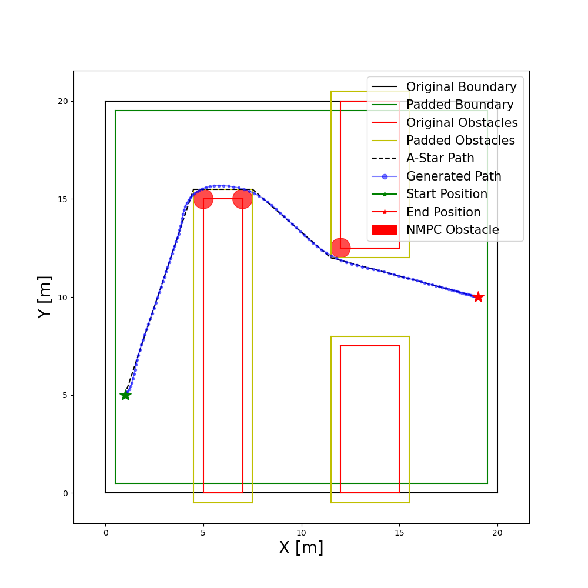

# mpc-trajectory-generator
Project in the course SSY226 Design project in systems, control and mechatronics given the autumn of 2020 at Chalmers University of Technology. We've implemented an algorithm that generates a smooth, collision free trajectory for a differential drive robot. 


## Dependencies

### OpEn
The NMPC formulation is solved using open source implementation of PANOC, namely [OpEn](https://alphaville.github.io/optimization-engine/). Follow the [installation instructions](https://alphaville.github.io/optimization-engine/docs/installation) before proceeding. 
### Python depecencies
To install all neccessary requirements, easiest way is to create an environment using conda by navigating to the root of this repo and run 
   ```
   conda env create -f env/environment.yml
   ```

Activate the environment using
   ```
   conda activate ssy226
   ```
   
If the environment file is changed, simply update an existing environment by running (at root of repo)
   ```
   conda env update -f env/environment.yml --prune
   ```

## Algorithm 
The algorithm is explained in detail in the accompinying (unpublished) [paper](docs/paper.pdf). In summary, the algorithm models the environment as polygons and find the shortest path using A*, implemented in the [extremitypathfinder](https://github.com/MrMinimal64/extremitypathfinder) python package. This path is then followed by an NMPC controller to generate a smooth trajectory for a differential drive robot. 

The algorithm can be run by running [main.py](src/main.py), make sure to set `build=True` if the NPMC solver hasn't been built before. By changing `g = graphs.get_graph(complexity=11)` to a different complexity, different predefined scenarios can be run. Different configuration exist in [configs](configs) and which to use is specified by changing the filename `config_fn = 'default.yaml'` to something different. **Note**, some of the config parameters require a rebuild of the NMPC solver to take effect. 

New scenarios can be added to [graphs.py](src/visibility/graphs.py) and tested by changing selected scenario in [main.py](src/main.py) as described above. Scenarios can easily be created by using the GUI implemented in [draw_graph.py](src/utils/draw_graph.py) and appedning the output to [graphs.py](src/visibility/graphs.py).

## Contribution
Feel free to open Issues and/or Pull requestes for bug reports/improvements. 
